# neurx-code Architecture Flowchart

```mermaid
graph TD
    A[neurx-code Application] --> B[Main Entry Point]
    B --> C[Application Environment]
    
    C --> D[Core Systems]
    D --> D1[Agent System]
    D --> D2[Bridge Layer]
    D --> D3[Editor Core]
    D --> D4[Execution Engine]
    
    D1 --> D1A[Agent Controller]
    D1 --> D1B[Agent Context]
    D1 --> D1C[Agent State]
    
    D2 --> D2A[LLM Integration]
    D2 --> D2B[Tool Registry]
    D2 --> D2C[Command Handler]
    
    D3 --> D3A[Editor Services]
    D3 --> D3B[Code Analysis]
    D3 --> D3C[UI Components]
    
    D4 --> D4A[Execution Context]
    D4 --> D4B[Plugin Manager]
    D4 --> D4C[Sandbox]
    
    E[Tool Ecosystem] --> E1[File Operations]
    E --> E2[Code Tools]
    E --> E3[Search Tools]
    E --> E4[Shell Tools]
    
    E1 --> E1A[WriteTool]
    E1 --> E1B[EditTool]
    E1 --> E1C[ReadTool]
    
    E2 --> E2A[Code Analysis]
    E2 --> E2B[Refactoring]
    E2 --> E2C[Compilation]
    
    E3 --> E3A[GrepTool]
    E3 --> E3B[GlobTool]
    
    E4 --> E4A[BashTool]
    
    F[Plugin System] --> F1[Plugin Validator]
    F --> F2[Plugin Loader]
    F --> F3[Plugin Manager]
    
    G[Persistence Layer] --> G1[State Management]
    G --> G2[Configuration]
    G --> G3[Memory System]
    
    H[Security Layer] --> H1[Sandbox]
    H --> H2[Permissions]
    H --> H3[Security Policies]
    
    I[UI Layer] --> I1[QML Components]
    I --> I2[Main Workbench]
    I --> I3[Chat Panel]
    
    D --> E
    D --> F
    D --> G
    D --> H
    D --> I
    
    style A fill:#e1f5ff
    style D fill:#fff3e0
    style E fill:#f3e5f5
    style F fill:#e8f5e9
    style G fill:#fce4ec
    style H fill:#ffe0b2
    style I fill:#e0f2f1
```

## Architecture Overview

### Core Components

**Application Core (Core Systems)**
- **Agent System**: Manages AI agent lifecycle and state
- **Bridge Layer**: Connects to LLM and handles tool communication
- **Editor Core**: Provides editor functionality and code analysis
- **Execution Engine**: Executes code and manages plugins

**Tool Ecosystem**
- **File Operations**: WriteTool, EditTool, ReadTool for file manipulation
- **Code Tools**: Analysis, refactoring, and compilation tools
- **Search Tools**: GrepTool and GlobTool for searching
- **Shell Tools**: BashTool for command execution

**Infrastructure**
- **Plugin System**: Validates, loads, and manages plugins
- **Persistence Layer**: Manages state, configuration, and memory
- **Security Layer**: Sandbox, permissions, and security policies
- **UI Layer**: QML components and workbench interface

### Data Flow

1. User input → UI Layer
2. UI Layer → Agent System
3. Agent System → LLM via Bridge Layer
4. LLM response with tools → Tool Registry
5. Tools execute → Execution Engine
6. Results → Bridge Layer → Agent State
7. State updates → UI refresh

### Key Features

- Modular architecture with clear separation of concerns
- Plugin-based extensibility system
- Comprehensive security sandbox
- Multi-layered persistence system
- Integrated LLM bridge for AI capabilities
- Rich QML-based user interface
