# NeurX Code Architecture Flowchart

```mermaid
graph TD
    A[NeurX Code Application] --> B[Main Interface]
    B --> C[Core Editor Engine]
    
    C --> D1[Agent System]
    C --> D2[Code Analysis Engine]
    C --> D3[Command System]
    C --> D4[Plugin Architecture]
    
    D1 --> D1A[LLM Integration]
    D1 --> D1B[Agent State Manager]
    D1 --> D1C[Conversation Context]
    
    D2 --> D2A[Syntax Analysis]
    D2 --> D2B[Code Parsing]
    D2 --> D2C[Error Detection]
    
    D3 --> D3A[Commit Commands]
    D3 --> D3B[Code Review Commands]
    D3 --> D3C[Refactoring Commands]
    
    D4 --> D4A[Plugin Registry]
    D4 --> D4B[Plugin Loader]
    D4 --> D4C[Plugin Manager]
    
    E[Plugin Ecosystem] --> E1[Agent SDK Dev]
    E --> E2[Feature Dev]
    E --> E3[Code Review]
    E --> E4[PR Review Toolkit]
    E --> E5[Security Guidance]
    
    F[IDE Features] --> F1[Editor]
    F --> F2[Terminal]
    F --> F3[File Explorer]
    F --> F4[Git Integration]
    
    G[Code Processing] --> G1[Parsing]
    G --> G2[Analysis]
    G --> G3[Suggestion]
    G --> G4[Refactoring]
    
    H[Output System] --> H1[Explanatory Style]
    H --> H2[Learning Style]
    H --> H3[Code Generation]
    
    I[Security & DevOps] --> I1[Security Guidance]
    I --> I2[Migration Tools]
    I --> I3[Container Support]
    
    C --> E
    C --> F
    C --> G
    C --> H
    C --> I
    
    style A fill:#e3f2fd
    style C fill:#fff3e0
    style D1 fill:#f3e5f5
    style D2 fill:#e8f5e9
    style D3 fill:#fce4ec
    style D4 fill:#ffe0b2
    style E fill:#e0f2f1
    style F fill:#f1f8e9
    style G fill:#fff9c4
    style H fill:#ede7f6
    style I fill:#ffccbc
```

## Architecture Overview

### Core Editor Engine
- **Agent System**: NeurX AI integration with conversation context
- **Code Analysis Engine**: Syntax highlighting, parsing, error detection
- **Command System**: Git commits, code reviews, refactoring operations
- **Plugin Architecture**: Extensible plugin system for features

### Plugin Ecosystem
- **Agent SDK Dev**: SDK development for agents
- **Feature Dev**: General feature development
- **Code Review**: Automated code review tools
- **PR Review Toolkit**: Pull request analysis
- **Security Guidance**: Security best practices

### IDE Features
- **Editor**: Multi-file editing with syntax support
- **Terminal**: Integrated terminal for commands
- **File Explorer**: Project file navigation
- **Git Integration**: Version control integration

### Code Processing Pipeline
1. **Parsing** - Code structure analysis
2. **Analysis** - Code quality and patterns
3. **Suggestion** - AI-powered recommendations
4. **Refactoring** - Automated code improvements

### Output System
- **Explanatory Style**: Detailed explanations
- **Learning Style**: Educational output format
- **Code Generation**: Generate code from descriptions

### Security & DevOps
- **Security Guidance**: Security recommendations
- **Migration Tools**: Code migration utilities
- **Container Support**: Docker and containerization
